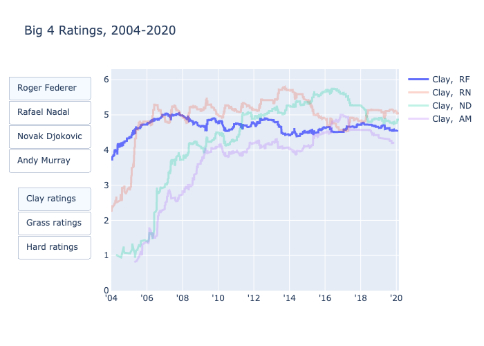

# tennis-elo
Implements a generalized Elo rating system for tennis players. Exposition of the math can be found in (https://hongsuh7.github.io). 

This implementation includes interactive visualization and prediction functionalities. Download and run `example.py` to see these in action.

Data used here is from [Jeff Sackmann's github](https://github.com/JeffSackmann/tennis_atp).

    

